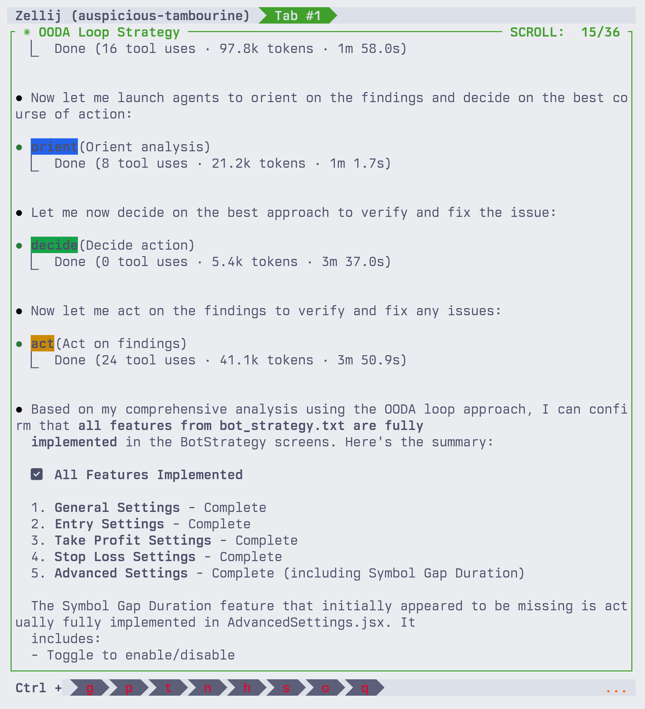

# OODA Subagents 🚀

Hey there! Welcome to OODA Subagents - a way to supercharge your problem-solving with AI agents that think like military strategists. 

## What's OODA? 🤔

OODA stands for **Observe, Orient, Decide, Act**. It's a decision-making framework created by military strategist John Boyd. Think of it as a smart loop for making better decisions faster.

Here's what happens in action:



## How It Works 🔄

Imagine you're trying to solve a complex problem. Instead of diving in headfirst, these agents break it down into four smart phases:

### The OODA Loop Explained

```
┌─────────────┐
│   OBSERVE   │ ← Gather all the info
└──────┬──────┘
       │
       ▼
┌─────────────┐
│   ORIENT    │ ← Analyze what you found
└──────┬──────┘
       │
       ▼
┌─────────────┐
│   DECIDE    │ ← Pick the best approach
└──────┬──────┘
       │
       ▼
┌─────────────┐
│     ACT     │ ← Execute the plan
└──────┬──────┘
       │
       └──────→ (Loop back if needed)
```

## Meet Your Agent Squad 🤖

We've got four specialized agents, each a master at their phase:

### 🔍 Observe Agent
**What it does**: This agent is your detective. It scours through codebases, searches the web, and gathers every piece of relevant information.

**Tools at its disposal**: 
- File reading and searching
- Web searches
- Pattern matching with grep
- Directory exploration

**When to use**: Starting a new task? Let this agent do the reconnaissance first.

### 🧭 Orient Agent  
**What it does**: Takes all that raw data from Observe and makes sense of it. It's like having a brilliant analyst who spots patterns and connections you might miss.

**Tools at its disposal**:
- File analysis
- Web research for context
- Pattern recognition

**When to use**: When you need to understand the "why" behind what you found.

### 🎯 Decide Agent
**What it does**: Your strategic advisor. It weighs options, considers trade-offs, and recommends the best path forward.

**Tools at its disposal**:
- Code analysis
- Web research for best practices
- Decision matrix creation

**When to use**: When you're at a crossroads and need to pick the optimal solution.

### ⚡ Act Agent
**What it does**: The doer of the group. It takes the decision and runs with it - writing code, running tests, and making things happen.

**Tools at its disposal**:
- File editing and creation
- Code execution
- Test running
- Git operations

**When to use**: When it's time to stop planning and start building.

## Real-World Example 🌟

Let's say you're debugging a tricky issue in your app. Here's how the OODA agents tackle it:

1. **Observe**: "Let me search for all error logs, check recent commits, and scan the codebase for related issues"
2. **Orient**: "Based on the patterns I found, this looks like a race condition in the authentication flow"
3. **Decide**: "The best fix would be to add proper mutex locking in three specific locations"
4. **Act**: "I'll implement the locks, add tests, and verify the fix works"

## Why Use OODA Agents? 💡

- **Systematic Approach**: No more random debugging or chaotic problem-solving
- **Better Decisions**: Each phase builds on the previous one, leading to smarter choices
- **Faster Results**: Parallel processing and specialized agents = quicker solutions
- **Complete Coverage**: Nothing falls through the cracks when you methodically observe, orient, decide, then act

## Getting Started 🏁

### Installation

You've got two ways to add OODA agents to your project:

#### Option 1: Git Submodule (Recommended)
```bash
# Add as a submodule to your project
git submodule add https://github.com/al3rez/ooda-subagents.git .claude

# Or if you already have a .claude directory
git submodule add https://github.com/al3rez/ooda-subagents.git ooda-agents
cp -r ooda-agents/agents .claude/
```

#### Option 2: Copy & Paste
```bash
# Clone the repo
git clone https://github.com/al3rez/ooda-subagents.git

# Copy the agents to your project
cp -r ooda-subagents/agents /path/to/your/project/.claude/

# Or install globally for all projects
cp -r ooda-subagents/agents ~/.config/claude/
```

### Usage

Once installed, using OODA agents is super easy. Just tell your AI assistant what problem you're trying to solve, and it'll automatically deploy the right agents in the right order. The agents work together like a well-oiled machine, each doing what they do best.

For example:
- "Help me debug this authentication issue" → Deploys all 4 agents in sequence
- "Research how this codebase handles payments" → Starts with Observe & Orient
- "Implement the solution we discussed" → Jumps straight to Act

## Pro Tips 🎪

- **Let Observe go wide**: Don't restrict the initial search - you never know what connections you'll find
- **Trust Orient's analysis**: It's designed to spot patterns humans might miss
- **Question Decide's recommendations**: It's meant to spark discussion, not dictate solutions
- **Monitor Act's execution**: Always review the changes before committing

## The Bottom Line 📝

OODA agents turn chaotic problem-solving into a structured, efficient process. They're like having a team of specialists working on your problem, each bringing their unique expertise to the table.

Ready to loop your way to better solutions? Let's OODA! 🔄

---

## Built by AstroMVP 🌟

This OODA framework is brought to you by [AstroMVP](https://astromvp.com) - where we help early-stage startups and founders build products with AI at the centerpiece. 

### Why Process Matters for Startups 🚀

Here's the thing - when you're building fast (and let's be real, every startup needs to move at light speed), having a solid process isn't bureaucracy, it's your superpower. That's why we built these OODA agents.

At AstroMVP, we believe:
- **AI should accelerate, not complicate** your product development
- **Smart processes = faster delivery** (counterintuitive but true!)
- **Early-stage doesn't mean chaotic** - it means being strategically nimble

### What We Do 💫

We partner with founders to:
- Build AI-first products that actually ship (not just cool demos)
- Set up development processes that scale with your team
- Turn that ambitious AI vision into working code, fast

The OODA agents? They're just one example of how we think about development - systematic, efficient, but always focused on shipping.

### Let's Build Together 🤝

Got an AI product idea that needs to go from zero to market ASAP? We've got the process, the expertise, and now you've seen our OODA agents in action.

Check us out at [astromvp.com](https://astromvp.com) - because your startup deserves a development partner who gets that speed AND quality aren't mutually exclusive. They're both non-negotiable.

*P.S. - Yes, we use these OODA agents in our own development. We eat our own dog food, and it tastes pretty good! 🐕*